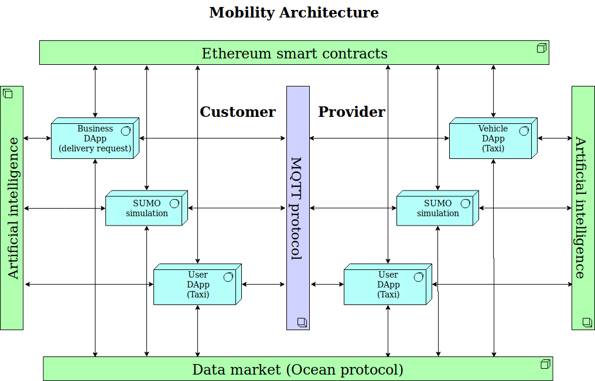

# Mobility Platform  

### About the project
Inspired from and for the [Mobi Grand Challenge](https://mobihacks.devpost.com/).  
Goal is to make a mobility platform what will represent the point where different tehnologies can intersect. It can be used for testing, simulation and production.  

### Arhitecture

### Vision
Ethereum smart contract where are all the rules and users stored and ready for interaction.  
DApp (Decentralized application), that can be used in two modes:  
1. Requesting a ride
2. Offer a ride  
	2.1 Mobile application (real user)  
	2.2 Embedded application (autonomous vehicle)  
	2.3 SUMO application (simulation)

1. Requesting a ride  
source code: destination link  
info:  
Enter destination and from available offers pick the one that is fastest or cheapest. Watch where  
2. Offer a ride   
2.1 source code: destination link  
info:  
2.2 source code: destination link  
info:  
2.3 source code: destination link  
info:  
nekaj o samovozečih avtomobilih in mehkemu prehodu z uporabo dapp-a, ki bo 
testiranje avtomatizirianih križišč ()

### Tehnologies
- [Ethereum](https://www.ethereum.org/) - Decentralized platform that runs smart contracts
- [React](https://reactjs.org/) - JavaScript library for building user interfaces
- [SUMO](http://sumo.dlr.de/index.html) - Simulation of Urban MObility
- [MQTT](http://mqtt.org/) - Machine-to-machine (M2M) "Internet of Things" connectivity protocol
- [web3.js](https://web3js.readthedocs.io/en/1.0/) - Ethereum JavaScript API
- [web3.py](https://web3py.readthedocs.io/en/stable/) - Ethereum Python API
- [Solidity](https://solidity.readthedocs.io/en/latest/) - Contract-oriented programming language for writing smart contracts
- [MetaMask](https://metamask.io/) - Browser plugin that allows you to run Ethereum dApps in your browser without running a full Ethereum node
- [ocean protocol](https://oceanprotocol.com/) - A protocol and network, on which data marketplaces can be built

### Usage

Demo DApp: http://www.mobi-dapp.com

### Video

### TO-DO

### Author
Primož Zajec  
[@115Primus](https://twitter.com/115primus)

