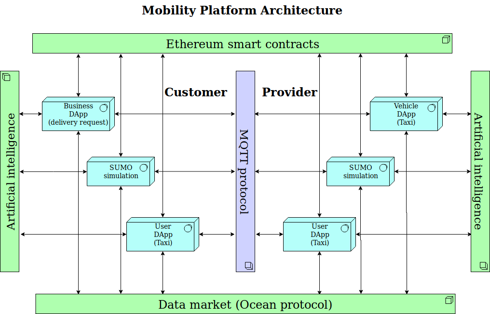
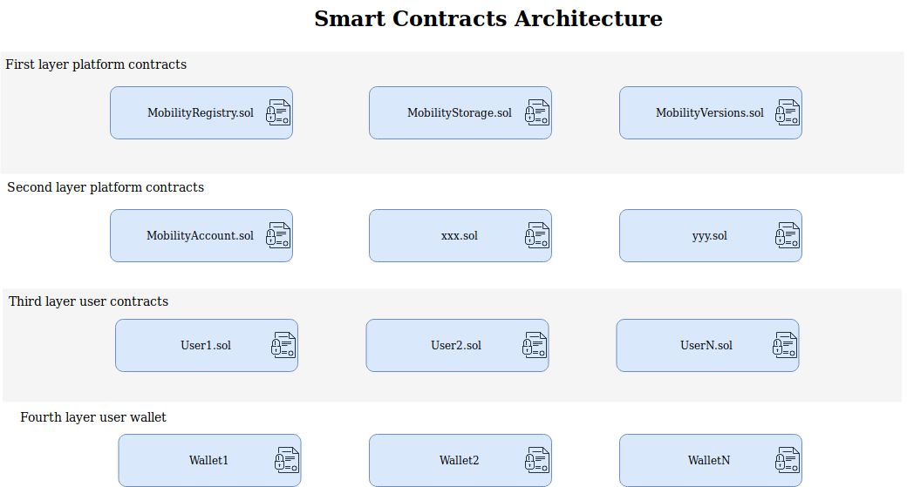
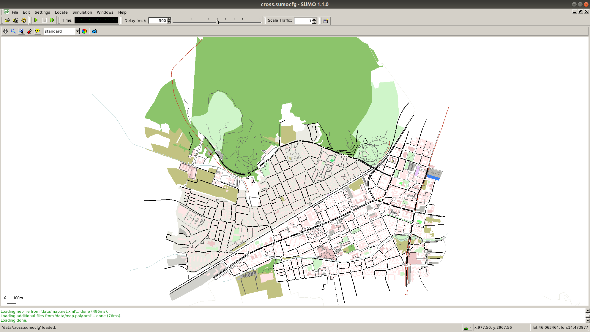
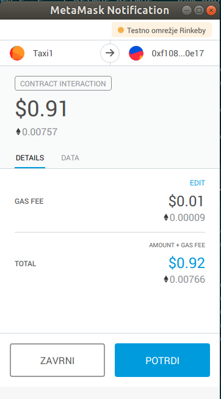

# Mobility Platform  

### About the project
Inspired from and for the [Mobi Grand Challenge](https://mobihacks.devpost.com/).  
Goal is to make a mobility platform what will represent the point where different tehnologies can intersect. It can be used for testing, simulation and production.   

First stage is to confirm the desired interaction between different tehnologies.  
Status: Functional Test Mode

### Tehnologies
- [Ethereum](https://www.ethereum.org/) - Decentralized platform that runs smart contracts
- [React](https://reactjs.org/) - JavaScript library for building user interfaces
- [SUMO](http://sumo.dlr.de/index.html) - Simulation of Urban MObility
- [MQTT](http://mqtt.org/) - Machine-to-machine (M2M) "Internet of Things" connectivity protocol
- [web3.js](https://web3js.readthedocs.io/en/1.0/) - Ethereum JavaScript API
- [web3.py](https://web3py.readthedocs.io/en/stable/) - Ethereum Python API
- [Solidity](https://solidity.readthedocs.io/en/latest/) - Contract-oriented programming language for writing smart contracts
- [MetaMask](https://metamask.io/) - Browser plugin that allows you to run Ethereum dApps in your browser without running a full Ethereum node
- [ocean protocol](https://oceanprotocol.com/) - A protocol and network, on which data marketplaces can be built

### Structure of the repository
Simulation DApp sources: [./](./)  
- main app: [runner.py](./runner.py)  

Web DApp sources: [./web/mqttMaps](./web/mqttMaps/)  
- main app: [MqttMap.js](./web/mqttMaps/src/MqttMap.js)  

Ethereum sources: [./web/mqttMaps/src/ethereum/](./web/mqttMaps/src/ethereum)  
- contracts: [DecentralizedMobilitySystem_V01.sol](./web/mqttMaps/src/ethereum/contracts/DecentralizedMobilitySystem_V01.sol)  

Docker: [Dockerfile](./docker/Dockerfile)   

### Arhitecture





### Description of the architecture
#### 1. Ethereum smart contracts (Developed)  
Ethereum smart contracts where are all the rules and users are stored and ready for interaction.  

**1.1 First layer platform contracts**  
In the first layer are the contracts that set the rules for the platform and store the data. Functional part and storage part are seperated, so if there is a need for critical functionality update of the platform, only **MobilityRegistry.sol** is updated and with the consensus the address of the new version of the contract is pushed and stored in the **MobilityStorage.sol**. and have permissions to interect with the storage contract. MobilityVersions stores addresses of updated **MobilityRegistry.sol** contracts, so DApps can ask for the address of the latest version.  

Deployed smart contracts on the Rinkeby Ethereum test net:  

**MobilityVersions**: 0xd067c87b3a4f7fd82542e4e6884d6e34d80de7de   
**MobilityStorage**: 0xed65fce4eac8430631b2b3f1d449c5c1d115c17e  
**MobilityRegistry**: 0x273532806a1d3a38197Ba46358Ea5eED756de7C1  

**1.2 Second layer platform "constructor" contracts**  
For now **MobilityAccount.sol** is the only one. If you want to offer a transportation services (like a taxi driver or a owner of the autonomous vehicle) than you will create new instance of this contract, with the help of the MobilityRegistry contract, where new instances of this contract are deployed. In the contract are defined functions like payRide, setDistance, getDistance, getIsPaid, price...  

**On this layer additional smart contracts can be created, that expands transportation segment also to other segments, like gas station segment (e.g. Tank&Drive&Bonuses), insurance segment (e.g. publish data get discount), used cars market (e.g. publish driver behavior profile and real distances - trusted seller), autonomous vehicle manufacturing segment (e.g. publish valuable data to desired company or brokerage company), car manufacturers segment (e.g. publish feedback data for specific vehicle model for the instant closed manufacturing loop & get bonuses or discount with new one)...**

**1.3 Third layer user contracts instances**  
Here are the instaces of the deployed accounts. Owner is the wallet that created the instance with the **MobilityRegistry** contract. Different DApps interact with specific account through this instance contract. Founds that collects on the contract with doing transportation service, can be tranfered at any time to any wallet only by the owner of the contract instance.  

**1.4 Fourth layer user wallets**  
Ethereum wallets are used for interaction with the deployed smart contracts and for the transfering ether (paying) to the MobilityAccount smart contract that will do (or is done) the transportation service for us.  

**Monetization**:  
Every contract has the funciton ownerRetriveDonations(address receiver), that can be executed at any time by the owner of the contract (the wallet that was used for creating the contract instance).
For the monetization testing was implemented functionality in the MobilityAccount that sends received_amount/10 to the MobilityStorage contract, the rest stays on the MobilityAccount contract instance.   
At the moment the amount the price for transportation request is hardcoded in the MobilityAccount contract (0.01 ether/km). But can be upgraded that can be changed by the owner of the contract instance.  

\*\* If there is a platform desire to have a very small percentage income from the transactions, than upgrade is needed. Becouse of the immutability reasons, reciving function must be implemented in the first layer contract, which forwards calculated amount to the MobilityAccount contract instance.   

#### 2. DApp (developed 1.1 and 2.2)
DApp (Decentralized application), that can be used in two modes:  
1. Requesting a transportation   
	1.1 Mobile application  
	1.2 Buisiness application
2. Offer a transportation   
	2.1 Mobile application (real user)  
	2.2 Embedded application (autonomous vehicle)  

**Requesting a transportation**  

	1.1 Mobile application (working prototype)   
	Enter destination and from available offers pick the one that is fastest or cheapest.
	todo:  
	- google.maps api requests for cusotm destinations  
	- Register new account for the mobility platform  

	1.2 Buisiness application (idea - not developed yet) 
	This can be different logistic application that needs transfers of any kind of goods. Probably MobilityAccount contract must be upgraded in some way that transporter stakes some ether, which is released back to him when specific rules are setisfied.

	
**Offer a transportation**   
 
	2.1 Mobile application - real user (idea - not developed yet)   
	Use application in the mode where the app listens to the published transportation requests. The app automatically response with the distance and the price. If you get chosen, do the transportation service.   
Long term goal is to have only autonomous vehicles in the transportation services. But in reality there will be a symbiosis with our cars and fully autonomous cars. And the app can help us to build the next generation transportation services and optimised travell routes (with the help of AI and IoT for smart traffic ligths). Besides the offer of the transportation services is also idea to have optimized navigation systems that we are already using it.   
	2.2 Embedded application - autonomous vehicle (developed in the simulation)  
	Application can be used for connecting autonomous vehicles with the mobility platform. Vehicle can get get route request, send the command to the navigation system, pick up a passenger or some item, do payment request and automatically when the payment is done finish the transportation service.  

#### 3. SUMO Simulation (simulation script developed)  
SUMO is an open source, highly portable, microscopic and continuous traffic simulation package designed to handle large road networks. It is mainly developed by employees of the Institute of Transportation Systems at the German Aerospace Center. SUMO is open source, licensed under the EPLv2.  
Sumo was chosen because of quick testing and quick evaluation of developed mobility platform features (on application layer and blockchain layer). In that way automated testing can be developed. It also supports any desired city plan import. For the demonstration I imported a map of Ljubljana, the capital of Slovenia. You can define speed of simulation, custom or repeatable vehicle trips. Additionally the simulation can be use for producing a lot of traffic data that is needed by the sophisticaded AI and machine learning tools, for traffic optimization.  

#### 4. MQTT protocol (used by the DApps and simulation)  
MQTT is a machine-to-machine (M2M)/"Internet of Things" connectivity protocol. It was designed as an extremely lightweight publish/subscribe messaging transport.    
It is ideal for publishing location data with high frequency. As such was also used as a communication mechanism of DApps, for publishing requests or responses and listening for requestst and responses.  
As it is pusblish/subscribe based, there is no need for some database with all DApps users. Requirements are that DApp must follow topic creating rules. For example, all requests for specific city based are published to the topic: "req/country_name/city_name" (e.g. "req/slovenia/ljubljana). So DApp of the transporter subcribes to the topic "req/country_name/city_name/#" (# is multi-level wild card, so can be also used like "req/country_name/#" for offering transportation across whole country).  
TODO:  
Exact project based topics specification


#### 5. Artificial intelligence (not developed yet)   
Idea is to offer and make a test polygon with the traffic simulation tool.  
Make a platform layer for developing different AI based optimization algorithms, that can be used for example to optimize traffic.   
Develpment can start with implementing open-source tool Flow. Flow is a traffic control benchmarking framework. It provides a suite of traffic control scenarios (benchmarks), tools for designing custom traffic scenarios, and integration with deep reinforcement learning and traffic microsimulation libraries.  Retrieved from (https://flow-project.github.io/index.html).

#### 6. Data market - Ocean protocol (not developed yet)   
Ocean Protocol is an ecosystem for sharing data and services. It provides a tokenized service layer that exposes data, storage, compute and algorithms for consumption with a set of deterministic proofs on availability and integrity that serve as verifiable service agreements. There is staking on services to signal quality, reputation and ward against Sybil Attacks. Ocean Protocol helps to unlock data, particularly for AI. It is designed for scale and uses blockchain technology that allows data to be shared and sold in a safe, secure and transparent manner.  
Retrived from (https://oceanprotocol.com/#project).

### Usage  
#### 1. Setup MetaMask and open web application
For interacting with the SUMO GUI, you will need ethereum wallet. Preferably MetaMask. In your browser (Chrome was tested):
1. [Install MetaMask plugin, swithc to the Rinkeby network and get some ether](https://www.youtube.com/watch?v=L88-x7EQi8g)   
p.s. unfortunately it is not real ether, but very good for generously testig DApps :)   
2. In the same browser with loged in to the MetaMask, open up my online DApp:  
www.mobi-dapp.com   
(I deployed react aplication to the the online server. But if you wish to further upgrade or test the web application, you can manually download the project, or do the ```git pull https://github.com/primus115/mobility.git```, cd to the folder /home/mobi/mobi/web/mqttMaps/ and install dependecies with ```npm install``` and finally start the server with ```npm start```. Another way is to spin a new container with the port forwarding 80:80 and from there install dependencies and start the server. Contact me for the client mqtt password if you don't set your own mqtt broker)  

#### 2. Docker install and preparing the image
Because there are many different tools used with the platform (many dependencies) is the fastest way to try out the whole package, with the help of Docker.   
The fastest way to do is to use the Docker.  
Docker runs processes in isolated containers. A container is a process which runs on a host. When an operator executes docker run, the container process that runs is isolated in that it has its own file system, its own networking, and its own isolated process tree separate from the host.  

It is awailable for Linux and Windows, but as we start developed mobility simulation, GUI is opened and for display sharing in Windows, there are some additional X Server installation required that I will not cover here.  

#### So let's begin on a Linux machine:   
Prerequisite is installed Docker:  
Do a whole Step1 from: (https://www.digitalocean.com/community/tutorials/how-to-install-and-use-docker-on-ubuntu-16-04)  

Now you have two options:  
**ONE:** Pull the docker image from the (https://cloud.docker.com/repository/docker/primus115/docker-mobi):   
1. Create an account on the https://hub.docker.com/)  
2. open the terminal and do the Docker login   
```bash
sudo docker login
```
3. Enter requested data (username and password)
4. Execute command:  
```bash
docker pull primus115/docker-mobi
```

**TWO:** Copy Dockerfile and build image with docker:
1. Open up a terminal (ctrl+alt+t)
2. Create a file "Dockerfile" with the command:  
```bash
touch Dockerfile
```  
3. Copy whole content of the file: [Dockerfile](./docker/Dockerfile)   
4. On your local machine open previously created file "Dockerfile"
5. Past in previously copied content and past it to the local file, save and close the editor  
6. Build a Docker image from a Dockerfile:  
In the folder where the Dockerfile was created, run a command:  
```bash
sudo docker build - < Dockerfile -t docker-mobi
```  

#### 3. Start a simulation  
In the web application, if you click on "Request a Ride!", nothing happens. This is becouse there is no clients (taxi drivers) connected to the platform. That is why, we will run the simulation, where we will simulate taxi drivers.  


#### Run the container with shared display:    
(As we start the simulation sctipt, GUI will be started in the container and display will be shared with the host system)   

1. Run the command:   
```bash
sudo docker run -it --rm\
    --env="DISPLAY" \
    --volume="/etc/group:/etc/group:ro" \
    --volume="/etc/passwd:/etc/passwd:ro" \
    --volume="/etc/shadow:/etc/shadow:ro" \
    --volume="/etc/sudoers.d:/etc/sudoers.d:ro" \
    --volume="/tmp/.X11-unix:/tmp/.X11-unix:rw" \
    --user=mobi \
    docker-mobi \
    bash
```   
Now, in the treminal you see something like: ```user@container_id:/home/mobi/mobi$```, that means you are in a running container.  
2. Run the simulation with the command:    
```bash
python runner.py
```
3. In the terminal you see: ```Enter the password for mqtt mobi user:```   
**Please send me a mail on za.primoz@gmail.com, and I will send you back the password. It's because the repository is public.**   
Write the password and press "Enter".   
4. GUI is opend:   
  
5. Decrease the delay (arrow 1) to: ```500```  
6. Press "start" button (arrow 2)
7. Now if you move back to the web app, and if you click on "Request a Ride!". You get back a list of avalable taxi drivers in the form "taxi_name: duration_from_taxi_location_to_you_plus_to_final_destination"   
8. Select one Taxi  
9. When you choose a Taxi, ethereum transaction happens. Selected car wants to write on his instance of the MobilityAccount smart contract (it sets a distance that futher defines cost of the transportation). For that it needs a private key, that is encrypted. So navigate back to the terminal where simulation was started, where you will see ```Enter the password for decryption:```   
**For the purpose of the competition "Mobi grant challenge" please contact me on my email: za.primoz@gmail.com, as I don't want to share private keys on a public repository. (one transaction can empty the account:) )**   
10. It takes a couple of seconds and the transaction is confirmed. Simulation also sends a message to the web app, with the payment details. If you are using MetaMask, notifications appears.   
  
11. Click on "Confirm"
12. Again it takes a couple of seconds, and when the taxi recives the paymant, transportation begins.   

If you have trubles setting up the environment and you are more used to Virtual machine like VirtualBox, than contact me and I will set one up for you.

### Video   
Here is a video of testing the application.   

<a href="http://www.youtube.com/watch?feature=player_embedded&v=OEyzdEqacko" target="_blank"></a>


### Author
Primož Zajec  
[@115Primus](https://twitter.com/115primus)


